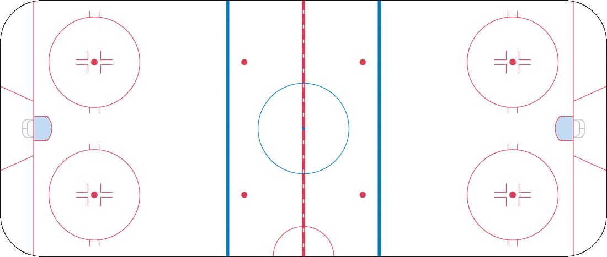

# NHL Analytics

The goal of this repository is to show you how we used NHL stats API to retrieve both aggregate data (player stats for a given season) and “play-by-play” data for a specific time period and to generate plots. We have created some simple visualizations from the aggregate data, and then moved to create interactive visualizations from the play-by-play data. Our work can be found in the form of a simple static web page (blog), which can be found in the following link: (INSERT LINK HERE).

Also included in this repo is an image of the NHL ice rink that you can use in your plots. It has the correct location of lines, faceoff dots, and length/width ratio as the real NHL rink. Note that the rink is 200 feet long and 85 feet wide, with the goal line 11 feet from the nearest edge of the rink, and the blue line 75 feet from the nearest edge of the rink.

The image can be found in [`./figures/nhl_rink.png`](./figures/nhl_rink.png).

